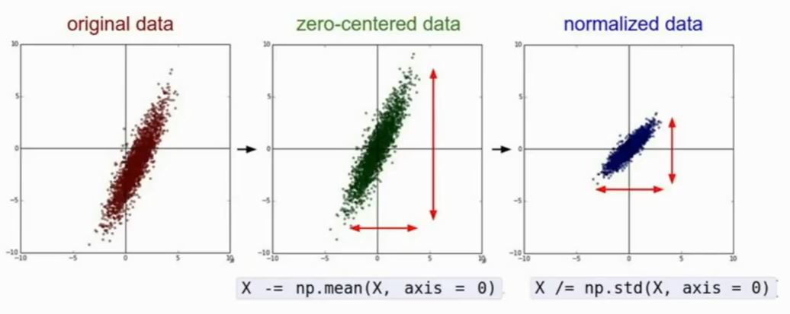
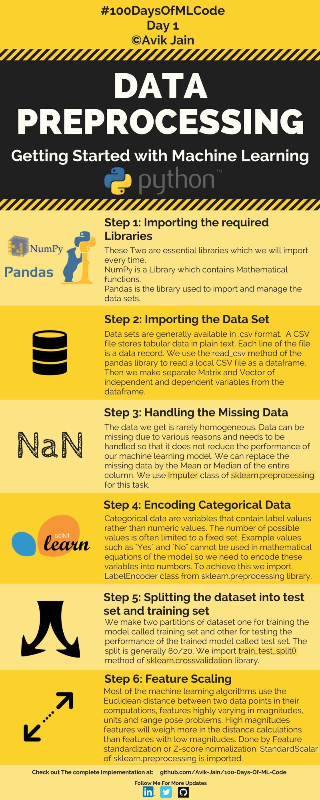

# 代码结构

## 文本预处理

### IO相关

- 从路径读入单个文件
- 从路径读入多个前缀匹配的文件
- 将文本写入路径

### 分章回

### 章回内去标点

### 章回内去回车

### 章回内分词

## 特征提取及预处理

### 特征提取

- 统计词频
- word2vec, doc2vec

### 特征预处理

- 随机划分数据集

	- 分类的话，测试集大小/数据集大小一般在 0.2~0.3左右

- zero-centered

	- 向量每个dim都减去所有训练数据对应dim的均值（需注意一定要**先划分数据集再进行Feature Scaling**操作！！！ ）

- Normalized

	- 向量的每个dim都除于所有训练数据对应dim的标准差（注意与CV的不同，CV一般不做normalized）
- etc
  

## 分类/聚类分析

### svm

### knn

### kmeans

## 数据展示

### 特征向量降维

### 二分类分布图

### 降维到二/三维向量展示

*XMind: ZEN - Trial Version*