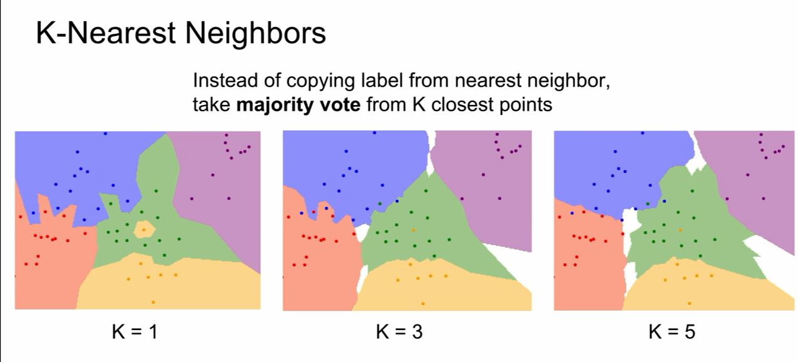

# 代码结构

## IO相关

### 从路径读入单个文件
### 从路径读入连续的x章
### 向路径写入单个文件
### 向路径写入连续的x章
### 将 array 存为 .npy 文件
### 从 .npy 文件读入 array

## 文本预处理

### 分章回

### 章回内去标点

### 章回内去回车

### 章回内分词

## 特征工程

### 特征提取

- 统计词频
- term frequency inverse document frequency 去除代表性不强的词
- word2vec, doc2vec

### 特征预处理

- 随机划分数据集

	- 分类的话，测试集大小/数据集大小一般在 0.2~0.3左右

- zero-centered

	- 向量每个dim都减去所有训练数据对应dim的均值（需注意一定要**先划分数据集再进行Feature Scaling**操作！！！ ）

- Normalized

	- 向量的每个dim都除于所有训练数据对应dim的标准差（注意与CV的不同，CV一般不做normalized）
- etc
  

图源来自<https://github.com/Avik-Jain/100-Days-Of-ML-Code>

- 注意这里只需要做 step 5&6，故手造轮子也够用了

## 分类/聚类分析

### naive bayes

### logistics regression

- train
- predict

### svm

- train
- predict

### knn

### 最大熵

### kmeans

- cluster center = 2

### mlp/nn

## 数据展示

### 特征向量降维（也可以放在数据预处理部分..算是交集吧..）

### 二分类分布图

### 降维到二/三维向量展示/分析

*XMind: ZEN - Trial Version*